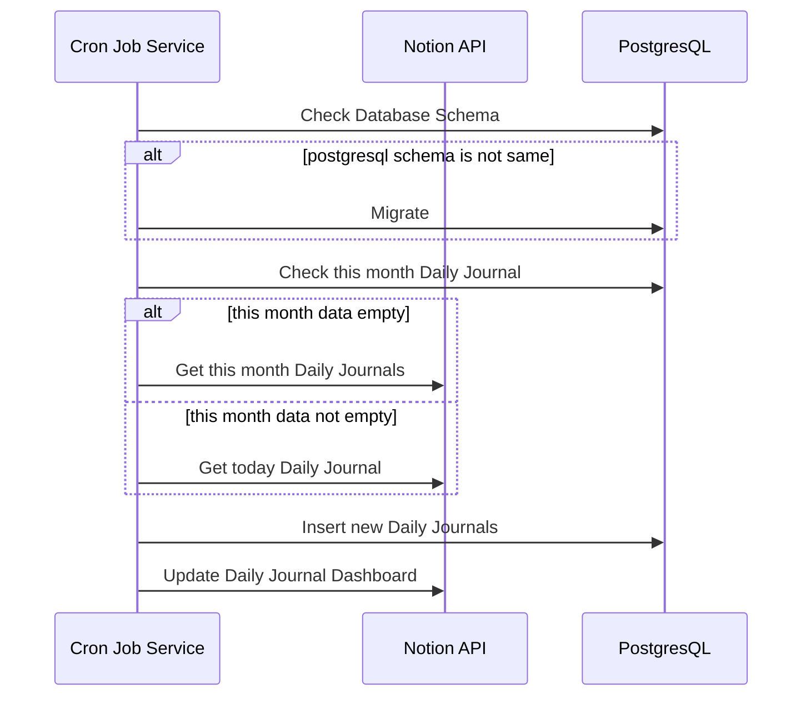

# Notion Dashboard

Simple job to update my internal notion dashboard.

## Stack
* [Rust Programming Language](https://www.rust-lang.org/)
* [docker (compose)](https://www.docker.com/)
* [sqlx](https://github.com/launchbadge/sqlx)
* [gcloud](https://cloud.google.com/sdk/docs/install)
* [Taskile](https://taskfile.dev/installation/)

## How it works

Basically this cron job just pull data from notion database, store it in PostgreSQL, and update a notion block item.
This notion block item serve as a non-realtime dashboard in the Daily Journal notion page.

## Sequence Diagram



## Development

1. Create `.compose.env` file and export it as environment variables
   ```
   cat << EOT > .compose.env
   POSTGRES_URL="db"
   POSTGRES_PORT="5432"
   POSTGRES_USER="<your_db_name>"
   POSTGRES_PASSWORD="<your_db_password>"
   POSTGRES_DB="notion_dashboard"
   NOTION_TOKEN="<your_notion_token>"
   NOTION_DJ_DATABASE_ID="<your_notion_dj_database_id>"
   NOTION_DJ_DASHBOARD_H1_ID="<your_notion_dj_dashboard_h1_id>"
   GCP_PROJECT="<your_gcp_project_id>"
   DATABASE_URL="postgresql://<your_db_name>:<your_db_password>@localhost:5432/notion_dashboard"
   EOT
   export $(xargs < .compose.env)
   ```
2. Build a Docker image with this command
   ```
   task image-build
   ```
3. Run docker compose
   ```
   task compose-up
   ```
4. Migrate database schema
   ```
   task migrate
   ```
5. Teardown docker compose and delete image
   ```
   task compose-down && task image-remove
   ```
